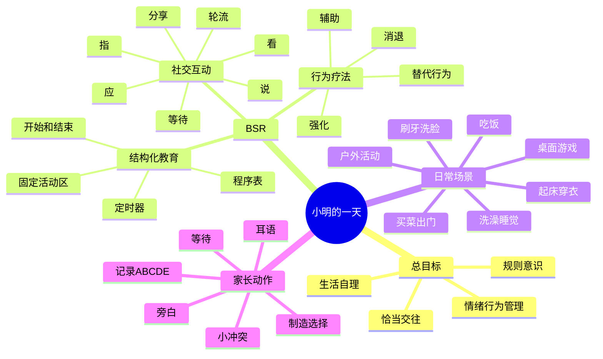

# 邹小兵《小明的一天》家庭自然情景干预

**标签**： #育儿方法论 #自闭症 #家庭干预 #社交沟通

> 这是对《小明的一天-邹小兵讲家庭自然情景的干预》的方法论整理。它是育儿和家庭干预参考，不替代医生诊断、发育评估或治疗方案。

## 核心结论

这本书的重点不是教几个孤立训练项目，而是把孩子一天的真实生活变成干预场景：起床、穿衣、刷牙、吃饭、出门、买菜、游戏、洗澡、睡觉，都可以用来训练社交沟通、生活自理、规则意识、情绪行为和认知语言。

一句话概括：**在自然生活里，用结构化安排承接孩子，用社交互动带动孩子，用行为方法强化孩子。**

## BSR 模式

BSR 是书中的核心框架：

- **B：行为疗法**  
  用强化、辅助、等待、消退、替代行为、自然后果等方式，增加恰当行为，减少问题行为。
- **S：结构化教育**  
  用程序表、固定流程、计时器、活动区域和清晰规则，让孩子知道“现在做什么、接下来做什么、什么时候结束”。
- **R：社交互动**  
  所有训练都尽量加入人和人的关系：看人、指物、回应、请求、拒绝、轮流、等待、分享、炫耀、求助、输赢和规则。

## 三个底层原则

1. **理解、宽容、接纳、尊重、赏识**  
   先看见孩子的发育特点和困难，不用羞辱、打骂、恐吓来推动。
2. **快乐、适度、巧妙地提升社交能力，管理问题行为**  
   干预不是把家变成训练机构，而是在孩子能承受的范围内，把互动机会嵌进生活。
3. **发现、培养、转化特殊兴趣和能力**  
   孩子喜欢开关、门、车、球、音乐、某个物品时，不只是禁止，而是把兴趣转成互动、规则、表达和生活技能。

## 最重要的早期目标

书里反复强调的早期社交目标，可以压缩成四个字：

**看、指、应、说。**

- **看**：看人、看物、看大人的反应，能用眼神确认、求助、分享。
- **指**：用手指表达想要、发现、选择，而不是只拉大人或自己拿。
- **应**：叫名有反应，能回应简单指令、表情、游戏规则和轮流。
- **说**：不是背很多内容，而是在情景里说有功能的话，比如“开门”“还要”“不要”“妈妈看”“帮我”。

对于小龄孩子，应景表达比背唐诗、背英文句子更重要。

## 家庭自然情景怎么做

### 1. 先做结构化

每天可以有一个简单程序：

- 起床
- 上厕所
- 穿衣穿鞋
- 刷牙洗脸
- 吃早餐
- 桌面活动
- 户外活动
- 回家休息
- 买菜/做饭
- 亲子游戏
- 洗澡
- 睡前流程

工具：

- 图片或文字程序表
- 计时器
- 固定活动角
- “开始/结束”提示
- 少量清晰规则

结构化不是僵硬控制，而是帮孩子建立时间、顺序、等待和完成感。

### 2. 每个生活环节都加入社交

起床：闹钟响、说早安、挠痒互动、下床。  
穿衣：给两件衣服选择，制造“你要红色还是蓝色”。  
刷牙：牙刷放在看得见但拿不到的地方，引出“要牙刷/帮我”。  
吃饭：不要总是提前照顾得过于周到，可以制造小小选择和请求。  
出门：孩子想开门时，等他说、指、看一眼，再开门。  
户外：滑梯、拍球、石头剪刀布都要加入排队、轮流、等待、输赢。  
看书：不要只读字，加入指图、故意说错、等待孩子纠正或看你。  
音乐：唱到关键处停顿，等孩子看、催、接一句，再继续唱。  
睡前：固定流程、低刺激、少说教，帮助形成稳定睡眠习惯。

### 3. 旁白和耳语

对少语言或语言功能弱的孩子，家长要多做“孩子视角”的旁白：

- “开门。”
- “我要包子。”
- “爸爸来了。”
- “我的鞋。”
- “还要。”
- “不要。”
- “妈妈看。”

重点不是逼孩子马上重复，而是持续输入可用语言。  
不要一直说“你说呀、叫爸爸、你怎么不说”，而是直接替孩子说出当下可用的话。

耳语适合互动游戏：妈妈在孩子耳边小声提示“给爸爸红色积木”“轮到我了”“我赢了”，帮助孩子在真实社交里说话。

### 4. 制造小小的“惊喜、冲突、折腾”

孩子不主动表达时，家长可以故意制造一点点不完整：

- 喜欢的东西放远一点。
- 给一个不想要的选择，引出拒绝。
- 唱歌唱到一半停下来。
- 故意说错图上的动物。
- 轮到孩子时先不动，等他催。
- 孩子喜欢开门，就用开门练“开门/要开/帮我/妈妈开”。

这些不是刁难孩子，而是创造沟通必要性。难度要小，孩子一有看、指、说、拉手求助等表达，就立刻回应。

## 行为管理

书中的行为管理可以用 ABCDE 记录：

- **A 前因**：行为发生前发生了什么？
- **B 行为**：孩子具体做了什么？
- **C 后果**：大人怎么反应，孩子得到了什么或逃避了什么？
- **D 措施**：下一次准备怎么处理？
- **E 效果**：措施有没有用？

基本原则：

- 不打、不骂、不唠叨。
- 好行为要立刻强化。
- 不会做时要辅助，而不是只责备。
- 哭闹索要不合理东西时，可在安全前提下有计划地忽略。
- 危险、攻击、破坏行为要明确制止，并使用短暂隔离、自然后果或逻辑后果。
- 刻板兴趣不要只禁止，要设计替代行为。

例子：

- 喜欢丢东西：不要只骂“不能丢”，可以安排投篮、丢沙包、往框里扔、河边丢石头，把行为转成规则游戏。
- 喜欢开关门：用“开门/关门/轮到妈妈/轮到宝宝/等一下”做互动。
- 抢手机：用计时器、轮流玩、结束提示，而不是突然抢走。
- 摔倒：先等孩子看大人或求助，再安慰、吹吹、问哪里疼，练求助和情绪表达。

## 一天中的训练主线

## 家庭可执行清单

每天不追求全做，只抓几个高频场景：

- 每天至少 3 次等待孩子表达，再帮他。
- 每天至少 3 次给二选一选择。
- 每天至少 3 次轮流游戏，如球、积木、投币、翻页、唱歌。
- 每天至少 1 次故意停顿，等孩子看、催或接话。
- 每天至少 1 次把孩子兴趣转成互动规则。
- 每天记录 1 个进步和 1 个卡点。

## 对本书方法的使用边界

可以直接吸收：

- 家庭自然情景干预
- BSR 框架
- 看、指、应、说
- 旁白、耳语、等待、选择
- 程序表和计时器
- ABCDE 行为记录
- 把特殊兴趣转化为互动

需要谨慎或不照搬：

- 用强烈惊吓、羞辱或过度惩罚来制造记忆。
- 让陌生人或“演员”推倒、抢东西来训练安全意识。
- 把孩子非常珍爱的物品故意损坏或丢弃。
- 过度追求训练强度，导致亲子关系长期紧张。

更稳妥的替代方式：

- 社交故事
- 角色扮演
- 视频分析
- 可控自然后果
- 图片规则
- 安全演练
- 家庭成员一致配合

## 和当前育儿计划的连接

这套方法可以直接接入现有每日育儿计划：

- 英语阅读不只看读了几本，要看孩子能否用在生活里。
- 桌游不只练认知，要加入轮流、等待、输赢和表达。
- 孩子喜欢投币、喂猪、开关、门、拉链，可以作为沟通入口。
- 如果孩子只是背诵，就把书中句子落到真实动作和真实需求里。
- 每天计划里可以增加一个“社交沟通观察”：今天有没有主动看、指、应、说。

