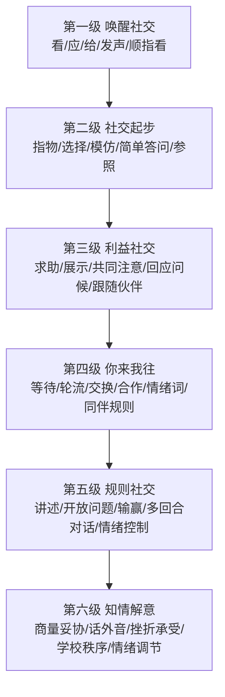

# 邹小兵《自闭症儿童社交能力阶梯训练》

**标签**： #育儿方法论 #自闭症 #社交能力 #BSR #家庭干预

> 资料来源：`/Users/lisuiting/Downloads/自闭症儿童社交能力训练阶梯，邹小兵.pdf`。  
> 本笔记基于扫描版 OCR 整理，个别字词可能有识别误差，已按上下文校正核心意思。

## 核心结论

这本书是《小明的一天》的系统升级版：把“社交”拆成六级阶梯和大量具体社交元素，再给出家庭可以使用的关键技术。

一句话概括：**社交能力不是抽象的“多和人玩”，而是可以拆成看、应、指、说、展示、参照、轮流、等待、合作、输赢、情绪调节等小能力，一阶一阶练。**

## 重新认识自闭症

书中较新的观点是从“谱系障碍”扩展到“谱系状态”：

- 自闭症有遗传和神经发育基础，不是家长养坏的。
- 但孩子与照顾者、家庭、学校、社区之间的互动会影响发展轨迹。
- 恰当养育和科学干预可以让孩子从“可能走向障碍”的轨迹，转向更好的适应状态。
- 干预目标不是消灭孩子的全部特质，而是帮助他获得自尊、自信、生活与学习能力。

## BSR 模式

BSR 是本书的核心：

- **B：Behavioral 行为疗法**  
  用强化、辅助、消退、温和惩罚、泛化等技术处理行为和建立能力。
- **S：Structured 结构化教育**  
  活动有组织、有计划，有时间、地点、参与者、内容、流程、视觉提示。
- **R：Relationship-focused 社交为核心**  
  干预重点是亲子二元互动和社会交往，不是单纯认知训练。

## 六级社交阶梯

### 第一级：唤醒社交

适合几乎无交往或交往动机很弱的孩子。

目标元素：

- 看
- 叫名回头
- 发声回应
- 伸手要
- 给
- 被动挥手再见
- 被动笑
- 顺着手指看
- 初步说/发音

### 第二级：社交起步

适合有独自倾向，但大人主动互动时可以应付的孩子。

目标元素：

- 依令看人
- 叫名能看会应
- 对“不”有反应
- 对“等一等”有反应
- 依令递物
- 执行一步指令
- 模仿
- 主动挥手告别
- 主动指表达要求
- 指物选择
- 依令指人/物/五官
- 摇头拒绝
- 用单词提要求
- 简单描述
- 主动叫人
- 简单答问
- 顺着他人眼神看
- 初级依恋
- 主动指表达兴趣
- 玩追逐游戏
- 被动展示
- 参照
- 看指应说组合运用

### 第三级：利益社交

孩子开始能为了需要、兴趣、喜欢的人或物而互动。

目标元素：

- 主动展示
- 自发共同注意
- 用语言求助
- 回应问候
- 用短语描述
- 回答简单问题
- 捉迷藏会找
- 主动迎接
- 被动跟随
- 高级依恋
- 简单告诉
- 你/我开始出现
- 说“我不要”
- 传话
- 告诉身体感觉
- 初级物权意识
- 提问动作
- 发起亲子游戏
- 接受邀请
- 跟随伙伴
- 说话有语调变化
- 生气表情
- 不跟陌生人走
- 想念

### 第四级：你来我往

开始进入来回互动、规则雏形和同伴互动。

目标元素：

- 主动问候
- 你/我/他不混淆
- 次级物权意识
- 回答连续问题
- 初级提问
- 说“我不知道”
- 复杂句型告诉
- 语言里有情绪词
- 知道他人身体感觉
- 会比较
- 炫耀
- 学会等待
- 懂轮流
- 听伙伴指挥
- 被动分享
- 捉迷藏会躲
- 开始安坐
- 主动跟随
- 告状
- 轮流说话
- 征求同意
- 羡慕、吃醋、撒娇
- 发出邀请
- 交换
- 开始懂合作
- 听老师指令
- 跟随集体活动
- 懂简单购物规矩
- 知安危
- 知亲疏

### 第五级：规则社交

适合已经有一定语言、认知和规则理解的孩子。

目标元素：

- 开放式问题
- 讲故事
- 讲述过去事情
- 提议将来事情
- 恰当拒绝伙伴
- 发起活动
- 换位观察
- 识别他人情绪
- 合作、对抗、竞争、懂输赢
- 角色扮演
- 礼貌
- 主动分享
- 多回合对话
- 听懂明显讽刺
- 同情和安慰
- 情绪控制
- 说悄悄话
- 早期内化语言
- 委屈、撒谎、耍赖、顶嘴、嫉妒等复杂社交现象
- 课堂坐定、举手回答、综合规则游戏

### 第六级：知情解意

适合更高阶的社会理解、学校适应和自我调节。

目标元素：

- 帮助他人
- 指挥
- 商量、妥协、让步
- 道歉、原谅
- 玩桌游
- 分享兴趣和想法
- 主题对话、修补对话
- 知对错、知好歹
- 听懂话外音
- 内化语言
- 挫折承受
- 集体荣誉感
- 完成作业
- 遵守学校秩序
- 自我安慰、自嘲、情绪调节
- 友谊稳定
- 独立买东西
- 在家附近玩后自行回家

## 六级阶梯图

## 家庭评估方法

本书的评估不是只看“会不会”，而是分三档：

- **通过**：日常至少 60% 情况下能完成。
- **出现**：10%-60% 情况下能完成，是当前重点干预项。
- **失败**：基本没有，可能暂不具备条件，先从前一阶梯练。

判断阶梯：

- 某阶梯 25%-50% 项目通过：进入当前阶梯。
- 50%-75% 项目通过：处于当前阶梯。
- 超过 75% 通过：进入下一阶梯。

这个评估特别适合家庭月度复盘。

## BSR 关键技术

### 1. 环境布置

- 划分游戏区、学习区、运动区、进餐区、休息区。
- 减少干扰。
- 使用照片、图片、文字做视觉显示。
- 把想要的东西放在看得见够不着、看得见打不开的位置，诱发求助和沟通。
- 零食/玩具分成小份，制造更多互动回合。

### 2. 跟随兴趣

开始互动时先进入孩子的兴趣，而不是一上来要求孩子跟随大人。

做法：

- 观察孩子看什么、做什么、为什么开心或发脾气。
- 给 2-3 个选择。
- 和孩子视线同一高度。
- 旁白孩子正在关注的东西。
- 模仿孩子恰当动作。
- 用夸张表情和声音增加互动感。

边界：

- 不合理要求要设限。
- 如果孩子沉迷重复行为且大人完全无法加入，暂时不跟随，改用替代活动或环境调整。

### 3. 延迟回应

不要把孩子照顾得过于周到。适度等一等，诱发孩子看、指、说、求助。

常用策略：

- 看得见够不着
- 看得见打不开
- 每次只给一点点
- 故意暂停
- 故意缺少关键材料
- 装作不明白，等待更清晰表达

### 4. 及时辅助

孩子不会时，不是反复命令，而是给辅助：

- 语言提示
- 手势提示
- 视觉提示
- 部分身体辅助
- 完全身体辅助

辅助后及时撤退，避免长期依赖。

### 5. 自然结果奖励和惩罚

孩子做出恰当沟通，就让沟通本身带来自然结果：

- 指杯子，就拿杯子。
- 说开门，就开门。
- 看妈妈求助，就帮忙。
- 等待成功，就轮到他。

惩罚也尽量用自然或逻辑后果，避免打骂和羞辱。

### 6. 应景式旁白

用孩子当下能用的话来替他说：

- “还要。”
- “打开。”
- “帮我。”
- “不要。”
- “妈妈看。”
- “轮到我。”

重点不是逼复述，而是让语言和真实场景绑定。

### 7. 加一原则

在孩子自发表达的基础上加一点：

- 无口语：孩子看你，成人说“高高”。
- 单词：孩子说“积木”，成人说“红色积木”。
- 短语：孩子说“吹泡泡”，成人说“要吹泡泡”。
- 简单句：孩子说“我要红色笔”，成人说“给你2支红色笔”。

### 8. 情景演练

用家庭模拟真实场景：

- 排队做操
- 打招呼
- 等待
- 分享
- 购物
- 看医生
- 小朋友抢玩具
- 不经同意拿东西

流程：

1. 选目标行为。
2. 设计场景和剧本。
3. 大人示范。
4. 孩子演练。
5. 录像回看。
6. 重复练习。
7. 到真实生活中泛化。

### 9. 社交故事

用第一人称、图片和短句讲清楚一个社交场景。

句型：

- 描述句：发生了什么。
- 观点句：别人可能怎么想、怎么感受。
- 指示句：我可以怎么做。
- 肯定句：为什么这样做是好的。

原则：

- 多写“该做什么”，少写“不要做什么”。
- 在孩子平静时读。
- 在将要遇到场景前读。
- 每日练习，直到掌握。

### 10. 录像分析

把正确行为和错误行为变成可视化学习材料：

- 拍孩子或同伴正确打招呼、等待、求助。
- 必要时拍不恰当行为及其后果。
- 和孩子一起看，简短讲解。
- 立即角色扮演。
- 到真实场景前复习。

### 11. ABCDE 技术

- **A 原因**：为什么发生？
- **B 行为**：具体做了什么？
- **C 后果**：得到了什么或逃避了什么？
- **D 处理策略**：大人怎么改变前因、行为或后果？
- **E 效果**：是否减少、增加或不变？

### 12. 十字方针

**观察、记录、分析、计划、执行。**

这是家庭版 IEP 的简化替代方案，适合家长在日常做闭环。

## 对当前宝宝的使用提示

宝宝已经具备很多第一级、第二级能力：叫名回应、眼神、指物、看大人确认、求助、分享开心、模仿和假装游戏都存在。不要把主要精力放在机械练眼神或叫名上。

更适合优先抓：

- 第二级巩固：对“不”“等一等”有反应，看指应说组合。
- 第三级：用语言求助、主动展示、简单告诉、接受邀请、跟随伙伴。
- 第四级早期：等待、轮流、交换、被动分享、发出邀请、开始合作、情绪词。

当前每日重点可以是：

- `等一下`
- `轮到我/轮到你`
- `帮我`
- `不要`
- `还要`
- `一起玩`
- `给妈妈看`
- `我生气了`

## 使用边界

书中个别“可控人为后果”例子不建议家庭照搬，例如安排陌生人推倒、抢东西等。对小龄孩子，优先用：

- 社交故事
- 情景演练
- 录像分析
- 大人示范
- 可控但不伤害的自然后果
- 提前预告和视觉规则

